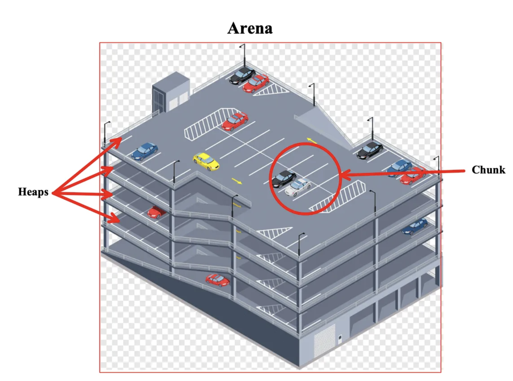

[what is Virtual Memory?](https://youtu.be/A9WLYbE0p-I)

[Anatomy of a Program in Memory](https://manybutfinite.com/post/anatomy-of-a-program-in-memory/)

the articles in this blog are all great: https://manybutfinite.com/archives/

sequential fit algorithms (first fit, next fit, best fit) 

[First-Fit vs. Best-Fit](https://courses.engr.illinois.edu/cs240/fa2020/notes/heapMemoryAllocation.html#:~:text=First%2Dfit%20is%20faster%2C%20allowing,every%20free%20block%20in%20memory)

[heap rules](https://azeria-labs.com/heap-exploitation-part-1-understanding-the-glibc-heap-implementation/)

mythili vutukuru's lectures

https://www.youtube.com/watch?v=bq3_uT5Z424&ab_channel=MythiliVutukuru

11-12-13

https://www.youtube.com/playlist?list=PLOzRYVm0a65dAAfy0d4aRtj5v0OCAvoCY

subheap via mmap

```
When the heap manager wants to create a subheap, 
it first asks the kernel to reserve a region of memory that the subheap can grow into by calling mmap*.
Reserving this region does not directly allocate memory into the subheap;
it just asks the kernel to refrain from allocating things like thread stacks,
mmap regions and other allocations inside this region.

his is done by asking mmap for pages that are marked PROT_NONE, which acts as a hint 
to the kernel that it only needs to reserve the address range for the region;
it doesn’t yet need the kernel to attach memory to it.
``` 
[source](https://azeria-labs.com/heap-exploitation-part-1-understanding-the-glibc-heap-implementation/)


```
Most malloc implementations share the behaviour of storing their own
management information, such as lists of used or free blocks, sizes of
memory blocks and other useful data within the heap space itself. Since the
whole idea of malloc/free is based on the dynamic requirements the
application has, the management info itself occupies a variable amount of
data too. Because of this, the implementation can seldomly just reserve a
certain amount of memory for its own purposes, but stores the management
information "in-band", right after and before the blocks of memory that are
used by the application.

Some applications do request a block of memory using the malloc interface,
which later happens to be vulnerable to a buffer overflow. This way, the
data behind the chunk can be changed.
```
[source](http://phrack.org/issues/57/9.html)

```
Large allocations are first rounded up to be a multiple of the page size. The allocator then uses a
first-fit algorithm to find space in the kernel address arena set aside for dynamic allocations.
[source](https://docs-archive.freebsd.org/44doc/papers/kernmalloc.pdf)
``` 


```
malloc spends most of its time managing the virtual memory space that has already been allocated, 
and only occasionally requests more memory from the OS (obviously this depends on the size of the items you allocate and how often you free).

There is a common misconception that when you free something it is immediately returned to the operating system.
While this sometimes occurs (particularly for larger memory blocks) it is generally the case that freed memory remains allocated to the process and can then be re-used by later mallocs.
``` 
[source](https://stackoverflow.com/a/4703838)


[what is a block?](https://en.wikipedia.org/wiki/Block_(data_storage))


```
For each dynamic memory request (e.g. malloc function call in C language or
new operator in C++/Java language), during the run time, the free list is searched sequentially.
If an appropriate size chunk cannot be found, one bigger has to be split up to
provide a chunk with the requested size. Once the dynamic
memory space (i.e. heap memory) is exhausted, operating
system’s function call such as sbrk() or brk() is made to
request for additional memory. While the allocated
memory is being freed, the memory chunk will be placed
back to the free list. Moreover, the immediate adjacent
memory chunks, if available, have to be coalesced with the
newly freed chunk to form a single large memory chunk.

In this paper, six different well-known
implementations of malloc and free functions are compared.  
```
[source](https://web.archive.org/web/20010615063859id_/http://ksa.iit.edu:80/~cs/publications/LeeW2_May_2000.pdf)


```
among the fastest possible versions of malloc() is one that always allocates the next sequential memory location available on the system, and the corresponding fastest version of free() is a no-op. However, such an implementation is hardly ever acceptable: it will cause a program to run out of memory quickly since it never reclaims unused space. Wastages seen in some allocators used in practice can be almost this extreme under some loads. As Wilson also notes, wastage can be measured monetarily: Considered globally, poor allocation schemes cost people perhaps even billions of dollars in memory chips.
```
[Doug Lea](https://gee.cs.oswego.edu/dl/html/malloc.html)


```
Fastbin is one of the four freelist data structures (fast bin, unsorted bin, small bin, large bin) that are used to hold free chunks. 
```

check [image](https://blog.fxiao.me/how-to-heap/) for illustration


Bins concept explained in this [series](https://infosecwriteups.com/the-toddlers-introduction-to-heap-exploitation-part-2-d1f325b74286)


in threads context, (the bonus part): ptmalloc-alike allocators.

a metaphor for the heap as a parking lot [source](https://infosecwriteups.com/the-toddlers-introduction-to-heap-exploitation-part-1-515b3621e0e8)


```
think of it as our school building:

the program consists of arenas (1337),
heaps (Etages/clusters),
and chunks (Ranges). 
```

    

for simple implementation of malloc and free, check:

Dr Marwan Burelle's article, i uploded it [here](./Marwan_Burelle.pdf) since it's not available online anymore.

this two articles:
 - https://danluu.com/malloc-tutorial/

 - https://mliezun.github.io/2020/04/11/custom-malloc.html


https://codebrowser.dev/glibc/glibc/malloc/malloc.c.html


```
void *malloc(size_t size) {
  struct block_meta *block;
  // TODO: 

  return(block+1);
}

we return block+1 because we want to return a pointer to the region after block_meta.
Since block is a pointer of type struct block_meta, +1 increments the address by one sizeof(struct block_meta).
``` 
[source](https://danluu.com/malloc-tutorial/)


